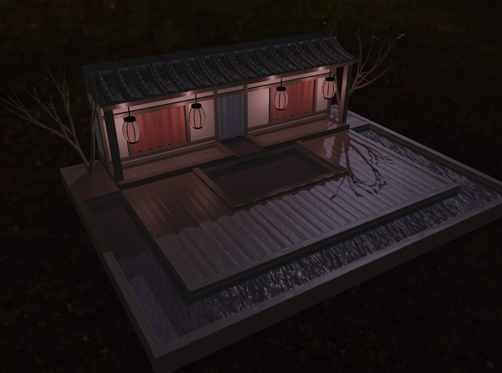

## PBR DEMO
Work in progress, physically based rendering demonstration. 



## Dependencies
[CMake]()  
[Vulkan](https://vulkan.lunarg.com/sdk/home)
[glfw3 3.3](https://www.glfw.org)  
[glm](https://glm.g-truc.net/0.9.9/index.html)
[assimp](https://www.assimp.org)

## Setting up Vulkan
* Download [VulkanSDK](https://vulkan.lunarg.com/sdk/home)

### MacOS
MacOS does not actually natively support Vulkan. However KhronosGroup has provided MoltenVK, an implementation of Vulkan that translates Vulkan calls to Metal, Apple's graphics API. As such, we require a bit of extra work to get Vulkan working on Mac.

* Make sure you've downloaded the MacOS version of the VulkanSDK
* Add Vulkan to your environment variables.
```
 $ echo "export VK_ICD_FILENAMES=[YOUR PATH TO VULKAN HERE]/macOS/etc/vulkan/icd.d/MoltenVK_icd.json" >> ~/.profile
 $ echo "export VULKAN_SDK=[YOUR PATH TO VULKAN HERE]/macOS/" >> ~/.profile
 $ echo "export VK_LAYER_PATH=[YOUR PATH TO VULKAN HERE]/macOS/etc/vulkan/explicit_layer.d" >> ~/.profile
```
If you are not using *~/.profile* as your shell profile you should change *~/.profile* to the path of your preferred shell profile.

## Building

* Building requires CMake version 3.14.4 or later

* Make sure you are in the root directory
```
$ cd [YOUR PATH TO pbr_demo]
```

* Then run the following
```
$ cmake -H. -Bbuild
$ cmake --build build -- -j3
```

## Authors

* **Arne Stenkrona**
